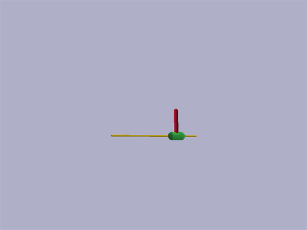
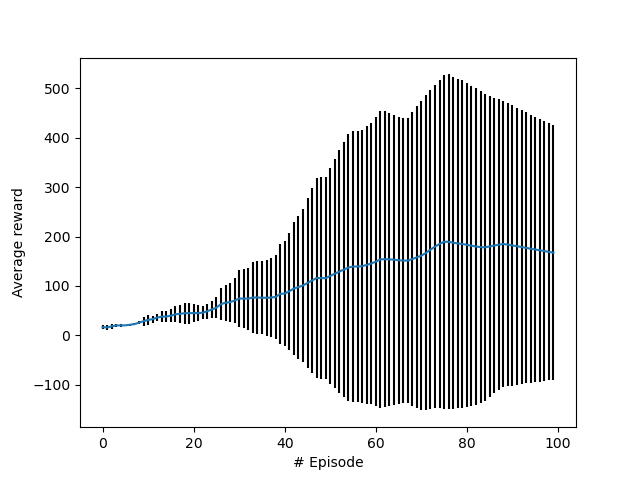
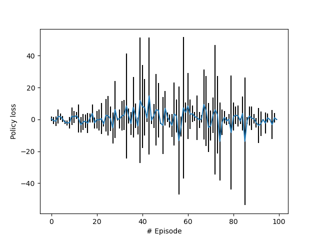
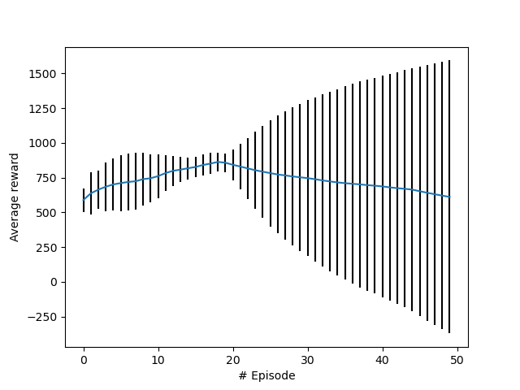
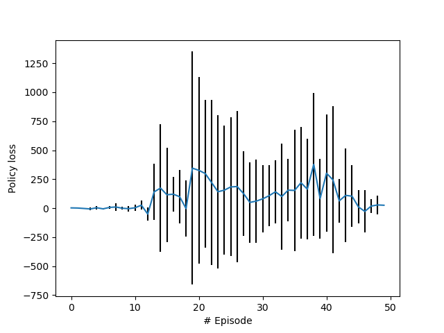
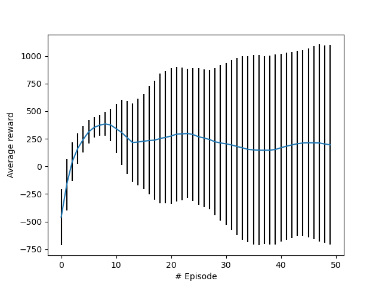
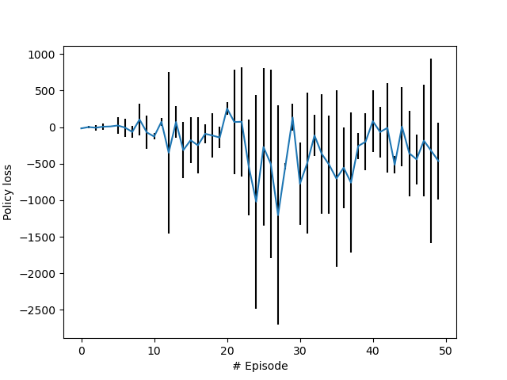

# REINFORCE with pytorch and pybullet

## How to train
* Run `__main__.py` with training options  
e.g., `python __main__.py  --env=AntBulletEnv-v0 -n=1 --num-episodes=1000 --render=True --pid=True`  
if you want to train `AntBulletEnv-v0` environment with 1000 episodes with PID and render the process.

## How to test
* Run `__main__.py` with testing options  
e.g., `python __main__.py  --env=AntBulletEnv-v0 --test=True --load=path/to/model.pth --pid=True`

## Results

### Demo (InvertedPendulumBulletEnv)
  
Tested at 700th episode w/o PID

### Average rewards (InvertedPendulumBulletEnv)

### Policy loss (InvertedPendulumBulletEnv)

### Demo (HalfCheetahBulletEnv)
  
Tested at 250th episode with PID

### Average rewards (HalfCheetahBulletEnv)

### Policy loss (HalfCheetahBulletEnv)

### Demo (AntBulletEnv)
  
Tested at 250th episode with PID

### Average reward (AntBulletEnv)

### Policy loss (AntBulletEnv)

## Reference
https://github.com/pytorch/examples/blob/master/reinforcement_learning/reinforce.py  
https://github.com/bulletphysics/bullet3/tree/master/examples/pybullet/gym/pybullet_envs  
https://github.com/NaleRaphael/cartpole-control/blob/master/cpc/agent.py  
Williams, R. J. (1992a). Simple statistical gradient-following algorithms for connectionist reinforcement learning. Machine Learning, 8:229–256.
